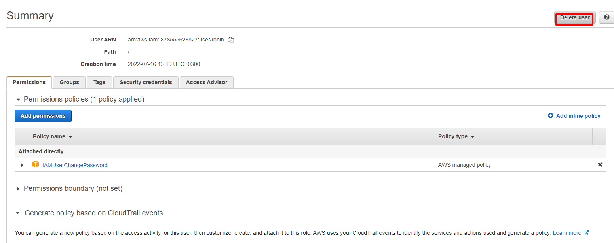

# Cloud Resume Challenge Series- Part I

In this CRC part I section, we are going to start with the challenge by setting up the AWS root/ IAM settings. We are going to:
* Ensure that root account has MFA enabled,
* There are no rooth user active keys 
* And we have a properly configured IAM user to manage the whole challenge with it.

  

In the following screenshot you can see that we have achieved the first the goals. Let's take a look at the last one.

## Creating an IAM user

Go to IAM, Users (under access management), add users.

Leave all the rest at default for now and create the user.

Now you have an access key and a secret access key.

## Add robin to the AWS vault

`aws-vault add robin`

Copy ans paste the access key ID and secret key when prompted.

You can find more information on aws-vault here: https://github.com/99designs/aws-vault

## Deleting a user

From the same IAM menu, you can delete any user as shown in the following:

## Downloading AWS Cli

**AWS-cli**: You can download here: 

https://docs.aws.amazon.com/cli/latest/userguide/getting-started-install.html

After the installation is complete verify by running the following command:

`aws --version`

the output will be similar tho this:

`aws-cli/2.7.16 Python/3.9.11`

## Assigining permissions to an IAM user

We created a group and attached the permissions to it. Then added robin to this group since we need to adjust permissions of a group, user to access AWS services. 

### Verifying s3 access of our user

`aws-vault exec robin -- aws s3 ls`

### Summry

Up to this point, what do we have?
* Aws cli
* Root account MFA enabled
* IAM user account of which credentials are storen on aws-vault
* IAM user with `AmazonS3FullAccess`

